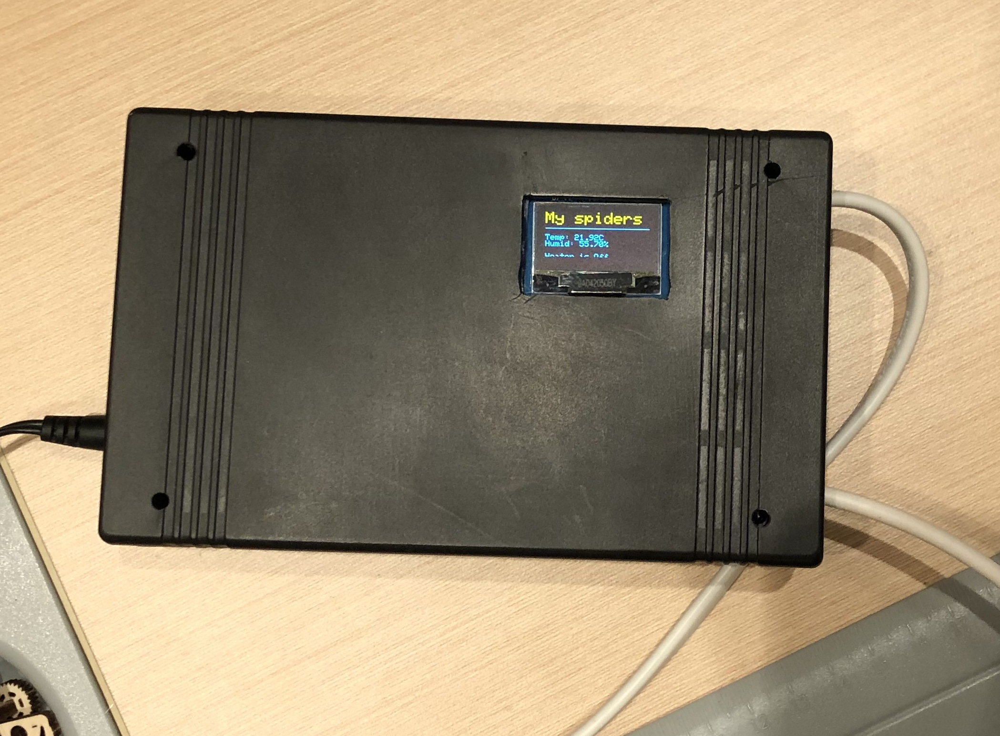

# ThermostatESP32

## IoT thermostat 

### We used electronic components:
<ol>
  <li>ESP32</li>
  <li>Relay (any arduino compatible)</li>
  <li>OLED Waveshare screen 0.96</li>
  <li>Thermometer STH-31</li>
  <li>Wires, box, AC/DC...</li>
</ol>

### We used software:
<ol>
  <li>Vue</li>
  <li>Axios</li>
  <li>ESPAsyncWebServer</li>
  <li>Adafruit libs for thermometer and OLED</li>
  <li>Alex Gyver's helper libs...</li>
</ol>

### What we'v got:

  
  

